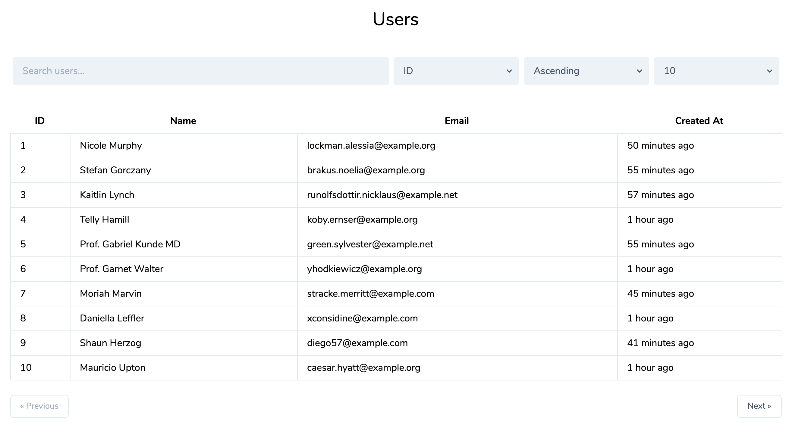

Original repo: https://github.com/davidgrzyb/laravel-livewire-datatable-example

Video Tutorial by davidgrzyb: https://www.youtube.com/watch?v=3B_BOQcghyA

---

## Livewire Datatable Example

This example contains a `UsersTable` component built with livewire that is a great example for how easy it is to build datatables with Livewire.

To install, clone this repo, run `composer install`, run `php artisan migrate --seed`, and then go to `/users`.

